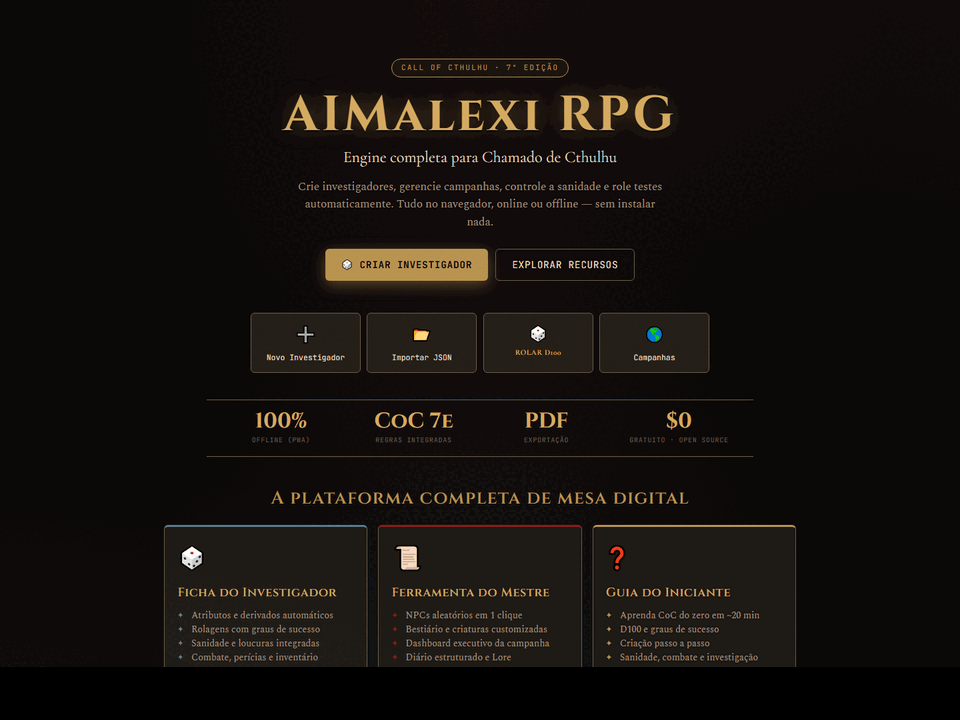
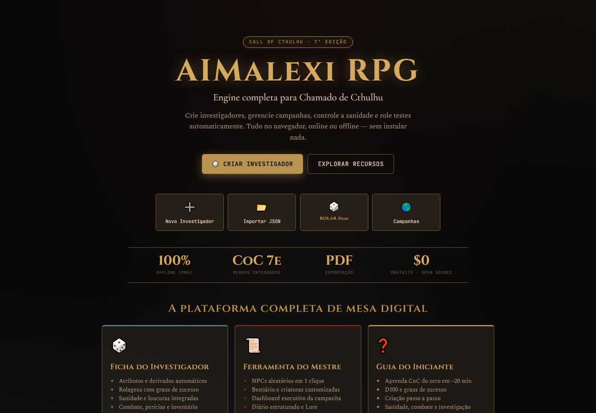
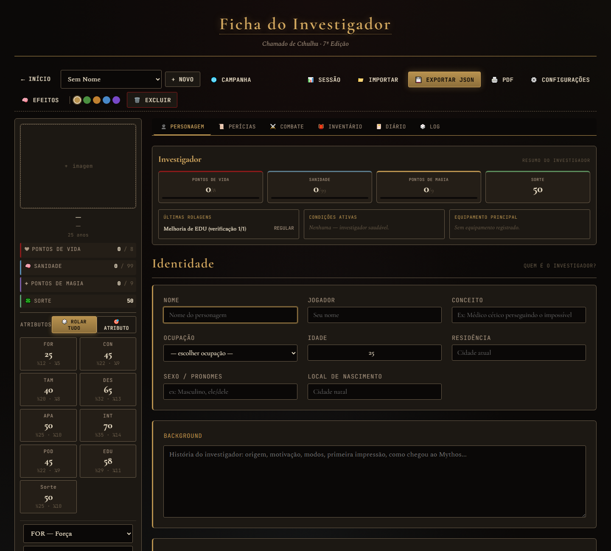
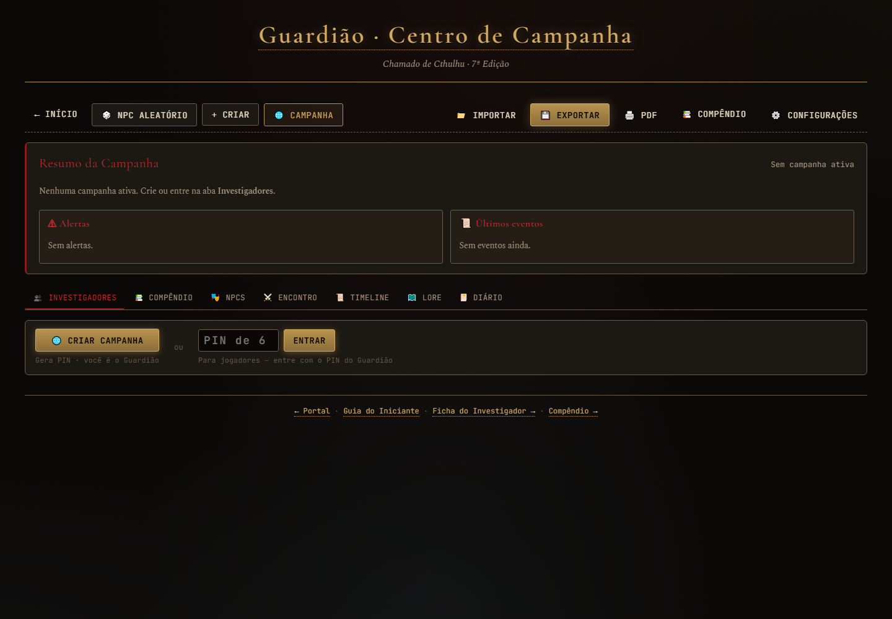
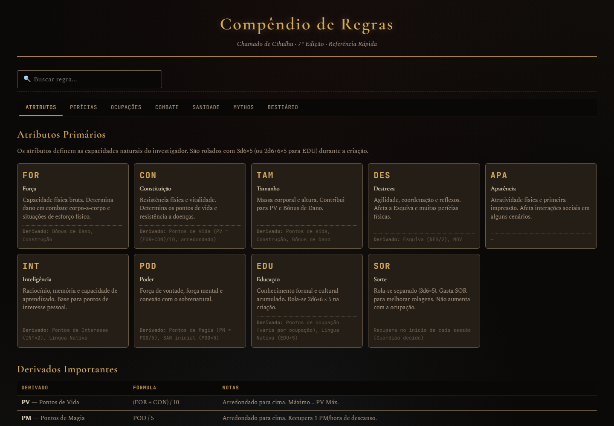

# AIMalexi RPG Ficha

Ferramenta web estatica em PT-BR para apoiar criacao e gerenciamento de fichas de
**Chamado de Cthulhu 7a Edicao**. O projeto roda no navegador, sem build e sem
dependencias obrigatorias de Node para uso normal.

Site publico, quando publicado pelo GitHub Pages:

https://m4alexii.github.io/AIMalexi_RPG_Ficha/

## Preview

Tour rapido pelas telas principais:



| Portal | Ficha do Investigador |
|---|---|
|  |  |

| Centro do Guardiao | Compendio |
|---|---|
|  |  |

## Status do Projeto

Este README foi atualizado para separar o que esta pronto do que ainda esta em
desenvolvimento. O projeto ja tem uma base grande de codigo, mas algumas areas
continuam em evolucao e nao devem ser tratadas como finalizadas.

### Funcionalidades Prontas

- **Portal inicial** em `index.html`, com acesso para investigador, Guardiao,
  guia do iniciante e compendio.
- **Ficha do Investigador** em `investigator.html`, com criacao/edicao de
  personagem, atributos, pericias, rolagens, vitais, inventario, diario,
  magias, tomos, financas, temas e impressao/salvar como PDF pelo navegador.
- **Persistencia local** via `IndexedDB`, com fallback para `localStorage` e,
  em ultimo caso, memoria durante a sessao.
- **Exportacao e importacao JSON de personagens**, incluindo suporte para
  backup portatil de imagens quando possivel.
- **Exportacao de sessao** pela ficha do investigador, com trace/eventos da
  sessao.
- **Ferramenta do Guardiao** em `keeper.html`, com NPCs/criaturas, biblioteca
  local, encontro, timeline/log, Lore, diario e visao de campanha em abas.
- **Exportacao e importacao JSON da biblioteca do Guardiao**.
- **Guia do Iniciante** em `guia-iniciante.html` e `GUIA-INICIANTE.md`.
- **Compendio de regras** em `compendium.html`, com busca e secoes de
  referencia resumida.
- **Suite de testes Node sem dependencias externas** em `js/tests/runner.js` e
  workflow de CI em `.github/workflows/ci.yml`.

### Em Desenvolvimento

- **PWA/offline**: `manifest.json` e `sw.js` existem e registram um service
  worker cache-first para os assets locais principais. Ainda assim, o modo
  offline deve ser tratado como parcial/em validacao, porque o multiplayer
  remoto depende de Supabase e o HTML ainda carrega o SDK do Supabase via CDN.
- **Multiplayer/campanhas remotas**: ha transporte por `BroadcastChannel` e
  Supabase Realtime. A persistencia duravel de campanha ainda esta em evolucao;
  ha fundacao em `js/campaign/`, `supabase/schema.sql` e testes de mock, mas
  nao trate isso como campanha online duravel finalizada.
- **Dashboard do Guardiao**: existem resumos e estruturas de campanha, mas
  varios fluxos ainda estao sendo refinados.
- **Compendio/biblioteca integrada**: ja ha dados e consulta, mas ainda nao e
  uma substituicao completa de livro, SRD ou biblioteca oficial.

### Funcionalidades Planejadas

- Multiplayer duravel gratuito com event log persistente, snapshot,
  reconexao e fila offline.
- Melhor integracao entre Guardiao e investigadores para eventos, dano,
  encontros e timeline.
- Biblioteca ampliada de equipamentos, precos, armas e referencias resumidas.
- Fluxos de combate avancado, como iniciativa completa, defesa/oposicao,
  municao, armadura e ferimentos graves automatizados.
- Testes E2E/visuais para os fluxos principais no navegador.

### Limitacoes Conhecidas

- Dados salvos no navegador podem ser perdidos se o usuario limpar cache,
  `IndexedDB` ou `localStorage`. Use exportacao JSON regularmente.
- Recursos de campanha remota dependem de internet, Supabase e configuracao
  correta de `js/config.js`.
- O PWA nao deve ser anunciado como "100% offline" enquanto o SDK remoto e a
  lista de precache nao forem validados em todos os fluxos.
- A suite automatizada existe, mas na auditoria desta documentacao
  (`2026-06-07`) retornou `872/888 passed`, com 16 falhas pre-existentes em
  proveniencia de pericias, ontologia/arquitetura e KPIs do dashboard.
- Algumas regras e fluxos de jogo seguem em backlog. Consulte
  `Melhorias/TODO_AUDIT_CoC7e.md` e `docs/ROADMAP.md`.

## Como Rodar Localmente

Nao ha build step. Para apenas usar a ferramenta:

1. Baixe ou clone o repositorio.
2. Abra `index.html` no navegador.
3. Navegue para a ficha desejada.

Para uma experiencia mais parecida com GitHub Pages, especialmente ao testar
service worker/PWA, use um servidor local:

```powershell
python -m http.server 8765
```

Depois abra:

```text
http://localhost:8765/
```

Observacoes:

- Abrir por duplo clique (`file://`) funciona para boa parte da ficha, mas
  service workers exigem `http://localhost` ou HTTPS.
- Nao e necessario rodar `npm install`.
- Para executar a suite automatizada:

```powershell
node js/tests/runner.js
```

## Publicacao no GitHub Pages

O projeto e compativel com GitHub Pages porque e estatico e usa caminhos
relativos.

Fluxo recomendado:

1. Mantenha a versao publicada em `main`.
2. No GitHub, abra **Settings > Pages**.
3. Em **Build and deployment**, escolha **Deploy from a branch**.
4. Selecione branch `main` e pasta `/ (root)`.
5. Salve e aguarde a publicacao.

Depois de um push para `main`, o site deve atualizar em alguns minutos:

```text
https://m4alexii.github.io/AIMalexi_RPG_Ficha/
```

Se alterar arquivos JS/CSS/HTML importantes e quiser que eles fiquem disponiveis
no cache offline, revise `PRECACHE_URLS` em `sw.js` e incremente
`CACHE_VERSION`.

## Backup, Exportacao e Importacao

### Investigador

- Use **Exportar JSON** na ficha do investigador para baixar um backup do
  personagem.
- Use **Importar JSON** para restaurar um personagem exportado.
- Use **Sessao** para exportar um JSON da sessao com eventos/trace quando esse
  dado for relevante para auditoria ou replay.
- Retratos/imagens podem ser armazenados como Blob no `IndexedDB`; na
  exportacao, o codigo tenta embutir dados portateis quando possivel.

### Guardiao

- Use **Exportar** na ferramenta do Guardiao para salvar a biblioteca local.
- Use **Importar** para mesclar uma biblioteca JSON.

### Boas Praticas

- Exporte personagens ao fim de cada sessao.
- Guarde backups fora do navegador.
- Antes de limpar cache/dados do navegador, exporte personagens e biblioteca.
- Ao testar importacao, confirme nome, atributos, pericias, inventario e imagens.

## PWA e Modo Offline

O projeto possui:

- `manifest.json`
- registro de service worker nas paginas principais
- `sw.js` com estrategia cache-first
- cache de arquivos locais principais

Estado atual: **em desenvolvimento/parcial**.

O uso local basico tende a funcionar sem rede depois que os arquivos foram
carregados e cacheados, mas ha ressalvas:

- multiplayer remoto nao funciona offline;
- o SDK Supabase ainda e carregado por CDN em `investigator.html` e
  `keeper.html`;
- a lista de precache precisa ser mantida sempre que novos arquivos entram;
- testes manuais de instalacao PWA/offline ainda devem ser feitos antes de
  anunciar suporte completo.

## Estrutura do Projeto

```text
AIMalexi_RPG_Ficha/
|-- index.html              Portal inicial
|-- investigator.html       Ficha do Investigador
|-- keeper.html             Ferramenta do Guardiao
|-- compendium.html         Compendio de referencia
|-- guia-iniciante.html     Guia renderizado em HTML
|-- GUIA-INICIANTE.md       Versao Markdown do guia
|-- README.md               Visao geral do projeto
|-- DEPLOY.md               Guia de publicacao/manutencao
|-- CLAUDE.md               Notas historicas para Claude Code
|-- AGENTS.md               Instrucoes atuais para agentes de IA
|-- CHANGELOG.md            Historico resumido de mudancas
|-- manifest.json           Manifesto PWA
|-- sw.js                   Service worker/cache
|-- css/                    Estilos das paginas e tema
|-- js/                     Engine, UI, core reativo, campanha e testes
|-- data/                   Dados JS: pericias, ocupacoes, bestiario, armas etc.
|-- docs/                   Roadmap e documentacao auxiliar
|-- assets/                 Assets e templates opcionais
|-- baseline/               Baselines de personagens/testes manuais
|-- supabase/               Schema SQL para a camada de campanha
|-- Melhorias/              Diretrizes, arquitetura e auditorias historicas
```

## Checklist de Teste Manual

- [ ] Abrir `index.html`.
- [ ] Abrir `investigator.html`.
- [ ] Criar ou carregar um investigador.
- [ ] Rolar atributo/pericia e conferir o log.
- [ ] Exportar personagem JSON.
- [ ] Importar o JSON exportado.
- [ ] Testar impressao/salvar como PDF pelo navegador.
- [ ] Abrir `keeper.html`.
- [ ] Gerar NPC ou criar criatura.
- [ ] Exportar/importar biblioteca do Guardiao.
- [ ] Abrir `guia-iniciante.html`.
- [ ] Abrir `compendium.html`.
- [ ] Em servidor local, testar carregamento com service worker.
- [ ] Depois de cacheado, testar comportamento offline basico.

## Como Contribuir

- Mantenha o projeto estatico, simples e compativel com GitHub Pages.
- Evite frameworks pesados ou build obrigatório.
- Nao altere regras, calculos ou comportamento da ficha sem necessidade clara e
  teste correspondente.
- Antes de mudar dados de jogo em `data/`, confira impacto em ficha,
  compendio, Guardiao e testes.
- Rode ao menos:

```powershell
node js/tests/runner.js
```

- Se a suite estiver falhando por baseline, registre isso no resumo da mudanca.
- Teste manualmente as paginas principais listadas acima.
- Atualize `docs/ROADMAP.md` ou `CHANGELOG.md` quando a mudanca alterar status,
  prioridade ou comportamento.

## Aviso Legal

Este projeto e **nao oficial**. Ele nao e afiliado, aprovado ou endossado pela
Chaosium Inc., New Order Editora ou qualquer detentor de direitos de
**Call of Cthulhu / Chamado de Cthulhu**.

Esta ferramenta nao substitui o livro basico nem materiais oficiais. Ela deve
ser usada como apoio de mesa e ficha digital.

Contribuicoes nao devem reproduzir textos proprietarios longos, aventuras
oficiais, arte oficial, tabelas extensas copiadas, PDFs, trechos protegidos ou
conteudo licenciado sem permissao. Prefira resumos originais, dados mecanicos
necessarios para a ficha e referencias curtas.

## Licenca

O codigo do projeto esta sob licenca MIT. Veja `LICENSE`.
